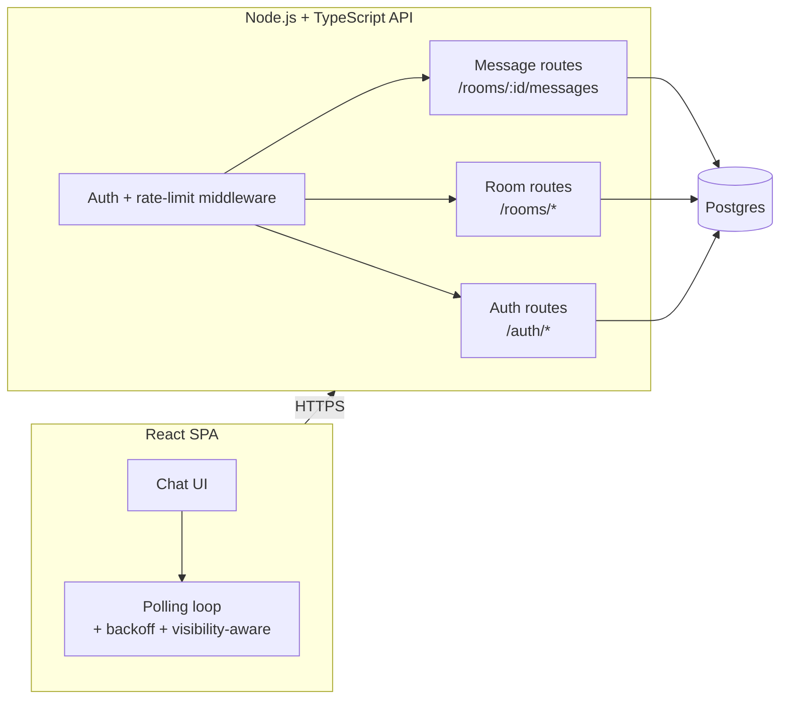

# Architecture — Chat App

## 1. Overview

A polling-based (no WebSockets) chat system: users, rooms, messages. The
interesting engineering isn't CRUD — it's making a *pull-based* sync model
behave like a reliable delivery system: no dropped messages, no duplicate
messages, no out-of-order rendering, even under concurrent writes and flaky
clients.

Three primitives make that possible, and they show up everywhere in this
doc:

- **Per-room sequence numbers** — a strictly increasing, gap-free integer
  per room, assigned atomically at write time. This is what lets a client
  say "give me everything after N" and know for certain it got everything.
- **Cursor (keyset) pagination** — every list endpoint (poll *and*
  scrollback) is paginated on that sequence number, never on `OFFSET`.
- **Refresh token rotation with reuse detection** — every refresh token is
  single-use; using one twice means it was stolen, so the whole token
  family gets revoked.

## 2. System Diagram



## 3. Components

| Component | Responsibility |
|---|---|
| React SPA | Auth screens, room list, chat view, the polling loop, cursor-based infinite scroll, optimistic send |
| API (Node/TS/Express) | Stateless request handling, JWT verification, business rules, all DB access |
| Postgres | Single source of truth — users, rooms, messages, sequence counters, refresh tokens |

No message broker, no cache layer, no WebSocket gateway. That's deliberate
— see [Non-Goals](#8-non-goals). Everything the "senior signal" comes from
is inside Postgres and the API layer, not from extra infrastructure.

## 4. Data Model

```sql
CREATE TABLE users (
  id BIGSERIAL PRIMARY KEY,
  username VARCHAR(32) UNIQUE NOT NULL,
  email VARCHAR(255) UNIQUE NOT NULL,
  password_hash TEXT NOT NULL,
  created_at TIMESTAMPTZ NOT NULL DEFAULT now()
);

CREATE TABLE rooms (
  id BIGSERIAL PRIMARY KEY,
  name VARCHAR(100) NOT NULL,
  created_by BIGINT NOT NULL REFERENCES users(id),
  created_at TIMESTAMPTZ NOT NULL DEFAULT now()
);

CREATE TABLE room_members (
  room_id BIGINT NOT NULL REFERENCES rooms(id) ON DELETE CASCADE,
  user_id BIGINT NOT NULL REFERENCES users(id) ON DELETE CASCADE,
  role VARCHAR(16) NOT NULL DEFAULT 'member',   -- 'owner' | 'member'
  joined_at TIMESTAMPTZ NOT NULL DEFAULT now(),
  PRIMARY KEY (room_id, user_id)
);

-- One row per room. Atomically incremented on every message send.
-- This table IS the sequence-number generator.
CREATE TABLE room_sequence_counters (
  room_id BIGINT PRIMARY KEY REFERENCES rooms(id) ON DELETE CASCADE,
  last_sequence BIGINT NOT NULL DEFAULT 0
);

CREATE TABLE messages (
  id BIGSERIAL PRIMARY KEY,
  room_id BIGINT NOT NULL REFERENCES rooms(id) ON DELETE CASCADE,
  sender_id BIGINT NOT NULL REFERENCES users(id),
  sequence_number BIGINT NOT NULL,
  client_message_id UUID NOT NULL,   -- idempotency key, generated by the sender's client
  body TEXT NOT NULL,
  created_at TIMESTAMPTZ NOT NULL DEFAULT now(),
  UNIQUE (room_id, sequence_number),      -- guarantees no duplicate/overwritten sequence
  UNIQUE (room_id, client_message_id)     -- guarantees retries don't create duplicates
);
CREATE INDEX idx_messages_room_seq ON messages (room_id, sequence_number);

CREATE TABLE refresh_tokens (
  id UUID PRIMARY KEY DEFAULT gen_random_uuid(),
  user_id BIGINT NOT NULL REFERENCES users(id) ON DELETE CASCADE,
  family_id UUID NOT NULL,          -- shared by every token descended from one login
  token_hash TEXT NOT NULL,         -- sha256 of the opaque token; raw token never stored
  created_at TIMESTAMPTZ NOT NULL DEFAULT now(),
  expires_at TIMESTAMPTZ NOT NULL,
  revoked_at TIMESTAMPTZ,
  replaced_by UUID REFERENCES refresh_tokens(id)
);
CREATE INDEX idx_refresh_tokens_family ON refresh_tokens (family_id);
CREATE INDEX idx_refresh_tokens_hash ON refresh_tokens (token_hash);
```

Design notes:

- `messages.id` (BIGSERIAL) is an internal storage key. `sequence_number` is
  the *logical* per-room ordering clients rely on. They're deliberately
  separate — never expose raw DB identity as the sync contract.
- The two UNIQUE constraints on `messages` are not decoration. They turn
  "the app logic should prevent duplicates" into "the database physically
  refuses duplicates." That distinction is exactly what a reviewer is
  checking for.
- Refresh tokens store a **hash**, never the raw token — a DB leak alone
  shouldn't be enough to hijack sessions.

## 5. Auth Flow

**Register** — `POST /auth/register` → hash password (bcrypt/argon2id) →
insert user.

**Login** — `POST /auth/login` → verify hash → issue:
- **Access token**: JWT, `{ sub: userId, iat, exp }`, 15 min expiry, kept
  in memory on the client (not `localStorage` — reduces XSS blast radius).
- **Refresh token**: opaque random string (NOT a JWT — it needs to be
  server-revocable, which self-contained JWTs resist), 256 bits of
  entropy, returned as an `httpOnly`, `Secure`, `SameSite=Strict` cookie.
  Stored server-side as `sha256(token)` with a fresh `family_id`.

**Refresh** — `POST /auth/refresh` (cookie sent automatically):
1. Hash the incoming token, look it up by `token_hash`.
2. Not found → 401.
3. Found but `revoked_at IS NOT NULL` → **this token was already used
   once.** Someone is replaying it — revoke every token sharing that
   `family_id`, return 401, force re-login.
4. Found, valid, unexpired → issue a new access + refresh token pair
   (same `family_id`), mark the old refresh token `revoked_at = now()`,
   `replaced_by = <new id>`.

**Logout** — revoke the current refresh token, clear the cookie.

This is what "rotation with reuse detection" means concretely: every
refresh token is single-use, and using a dead one is the signal that a
token has been stolen and copied.

## 6. Message Send Flow (atomic sequence + idempotency)

`POST /rooms/:roomId/messages { body, client_message_id }`

1. Verify the sender is a member of `roomId` (403 if not).
2. In one transaction:
   ```sql
   INSERT INTO room_sequence_counters (room_id, last_sequence)
   VALUES ($roomId, 1)
   ON CONFLICT (room_id)
   DO UPDATE SET last_sequence = room_sequence_counters.last_sequence + 1
   RETURNING last_sequence;
   ```
   The `UPDATE` takes a row lock on that room's counter row — two
   concurrent senders in the same room serialize here instead of racing.
   That's the whole concurrency story: one row lock per room, held for
   microseconds.
3. Insert the message using the returned sequence number:
   ```sql
   INSERT INTO messages (room_id, sender_id, sequence_number, client_message_id, body)
   VALUES ($roomId, $senderId, $seq, $clientMessageId, $body)
   ON CONFLICT (room_id, client_message_id) DO NOTHING
   RETURNING *;
   ```
   If the client retried a send (network blip, double-tap), the
   `client_message_id` uniqueness makes the retry a no-op — fetch and
   return the original row instead of erroring.

## 7. Poll (Sync) Flow and Cursor Pagination

**Live sync (poll)** — `GET /rooms/:roomId/messages?after=<cursor>&limit=50`,
called on an interval while a room is open:

```sql
SELECT id, room_id, sender_id, sequence_number, body, created_at
FROM messages
WHERE room_id = $roomId AND sequence_number > $afterSeq
ORDER BY sequence_number ASC
LIMIT $limit;
```

Response:
```json
{
  "messages": [ /* ordered, sequence_number ascending */ ],
  "latest_sequence_number": 482,
  "has_more": false
}
```

The client's cursor is simply "the highest `sequence_number` I've
rendered." Because sequence numbers are contiguous and unique per room,
"everything after my cursor" is always the complete, exact set of what's
missing — there's no separate "gap detection" algorithm needed beyond
always resuming from the last acknowledged cursor rather than from wall
clock time. If `has_more` comes back true, the client re-fetches
immediately instead of waiting for the next poll tick — that's how a
client that was offline for 10 minutes catches up in a couple of round
trips instead of missing anything.

**History (scrollback)** — `GET /rooms/:roomId/messages?before=<cursor>&limit=50`:

```sql
SELECT id, room_id, sender_id, sequence_number, body, created_at
FROM messages
WHERE room_id = $roomId AND sequence_number < $beforeSeq
ORDER BY sequence_number DESC
LIMIT $limit;
-- reverse in application code before rendering
```

Cursors are opaque to the client (`base64(JSON.stringify({ seq }))`), not
a raw integer in the URL. That's a deliberate API-design choice, matching
how Stripe/Slack do it — it means the internal representation can change
later without breaking anyone depending on the API. Both directions reuse
the same underlying primitive (`sequence_number` comparison), which is
worth noticing: poll and scrollback are the same mechanism pointed in
opposite directions, not two separate systems.

## 8. Non-Goals

Deliberately out of scope, to keep the focus on messaging-delivery
correctness rather than feature breadth:

- Message editing / deletion
- Typing indicators, read receipts, presence
- File/image attachments
- Push notifications
- End-to-end encryption
- Horizontal scaling of the API (single instance is assumed; see
  [Rate Limiting](#9-rate-limiting) for what changes if that stops being
  true)

## 9. Rate Limiting

Per-user, per-endpoint token bucket, enforced in-process (in-memory map,
no Redis) — appropriate for a single API instance. If this ever runs on
more than one instance, the bucket state needs to move to something
shared (Redis) since in-memory state won't be consistent across
processes. Documented here as a known, deliberate limitation rather than
an oversight.

## 10. What a Reviewer Should Notice

- `UNIQUE(room_id, sequence_number)` + the row-locking `UPDATE ...
  RETURNING` pattern means duplicate or skipped sequence numbers are
  structurally impossible, not just "shouldn't happen in practice."
- Refresh tokens are opaque + hashed + single-use with family-level
  revocation — a stolen token is detected on first reuse, not never.
  ([Auth0: refresh token rotation](https://auth0.com/docs/secure/tokens/refresh-tokens/refresh-token-rotation))
- Every list endpoint is keyset-paginated. There is no `OFFSET` in this
  codebase. ([Use the Index, Luke — no offset](https://use-the-index-luke.com/no-offset))
