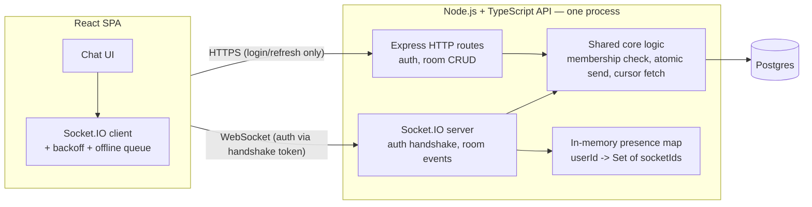

# Architecture — Chat App v2 (WebSockets)

## 1. Overview

v1 made a *pull-based* (polling) delivery model behave like a reliable
one. v2 replaces the transport with a *push-based* one (Socket.IO) and
asks a harder question: can you keep every one of v1's correctness
guarantees — no dropped messages, no duplicates, no out-of-order
rendering — once the network can fail in the middle of an open
connection, not just between discrete requests?

That reframe matters more than the features themselves. A typing
indicator is easy. A reconnect strategy that never loses a message and
never double-delivers one — while also detecting a half-dead connection
the OS hasn't noticed yet — is what separates "I added Socket.IO" from
"I understand what a persistent connection actually costs you."

**What's preserved from v1, unchanged:** the Postgres schema, the atomic
per-room sequence-number generator, the two `UNIQUE` constraints that
make duplicates structurally impossible, room-membership authorization,
and the entire JWT auth system (access token + rotating refresh token
with reuse detection). v2 does not touch any of that — it reuses it.
The socket layer is a new *transport* on top of the same *core*, not a
parallel system. Wherever possible, a socket event handler is a thin
wrapper that calls the exact same repository function an HTTP route
already calls.

**What's new:** Socket.IO server mounted alongside the existing Express
app, live typing indicators, online/offline presence, reconnection with
exponential backoff, a client-side offline message queue with
guaranteed-once-delivered replay, heartbeat-based dead-connection
detection, and a reconnect catch-up flow that closes the exact gap v1's
polling used to close on its own.

## 2. System Diagram



Socket.IO shares the same HTTP server and port as Express
(`new Server(httpServer)`, not a second listener) — one process, one
deploy, no new infrastructure. `/auth/*` (login, register, refresh) stays
plain HTTP, because refresh tokens live in an `httpOnly` cookie that only
makes sense in a request/response model. Everything room- and
message-related moves to the socket.

## 3. What Changes vs. v1, Explicitly

| Concern | v1 | v2 |
|---|---|---|
| Message delivery | Client polls `GET /rooms/:id/messages` on an interval | Server pushes `new_message` the instant it's written |
| Missed-message recovery | Every poll re-asks "anything after my cursor?" | Explicit catch-up step on reconnect only (§7) — no periodic re-ask |
| Auth | JWT verified per HTTP request via middleware | JWT verified once at handshake, then re-verified on token expiry mid-connection (§4) |
| Rate limiting | Per-request middleware, before the route handler | Per-socket-event handler, no middleware chain to hook into (§10) |
| Presence / typing | Explicitly a v1 non-goal | Core v2 feature (§8, §9) |
| Horizontal scaling | Assumed single instance | Still assumed single instance — see §12 for what changes if that stops being true |

The message-send **core logic itself** — membership check, row-locked
sequence increment, idempotent insert — does not change at all. It moves
from being called by an Express route handler to being called by a
Socket.IO event handler. Same function, different caller.

## 4. Connection Lifecycle & Auth

**Handshake.** The client connects with its in-memory access token:

```ts
io("wss://api.example.com", { auth: { token: accessToken } });
```

A Socket.IO middleware verifies it before the connection is accepted:

```ts
io.use((socket, next) => {
  try {
    const payload = verifyAccessToken(socket.handshake.auth.token);
    socket.data.userId = payload.sub;
    next();
  } catch {
    next(new Error("unauthorized")); // rejects the handshake outright
  }
});
```

Rejecting at the handshake means an unauthenticated client never gets a
`socket.id`, never enters any room, never touches presence — there's no
window where an unauthenticated socket exists in a half-initialized
state.

**Token expiry mid-connection.** The access token is deliberately
short-lived (15 min, per v1). A socket can live for hours. Two options
exist: force a full reconnect on every token refresh, or reauthenticate
the *same* socket in place. v2 does the latter, because forcing a
reconnect on a healthy connection just to rotate a token is wasted work
and a needless gap in delivery:

1. Server sets a per-socket timer for `exp - 60s`.
2. When it fires, emit `token_expiring` to that socket.
3. Client calls the existing HTTP `/auth/refresh` (cookie-based, exactly
   as in v1) to get a new access token, then emits
   `reauth: { token: newAccessToken }` **on the same socket** — no
   disconnect involved.
4. Server re-verifies, resets the timer.
5. If the client never reauths and the token actually expires, the
   server force-disconnects with a specific reason
   (`disconnect_reason: "token_expired"`) so the client's reconnect logic
   knows to refresh *before* attempting to reconnect, rather than
   retrying with a token that will just be rejected again.

**Joining a room.** `join_room: { roomId }` → server runs the *same*
membership check v1's `requireRoomMembership` does (refactored into a
plain function called from both the Express middleware and this socket
handler) → `socket.join(roomId)` on success, or an `error` event
(`FORBIDDEN` / `NOT_FOUND`, same codes as v1's HTTP error shape) on
failure. A client is never silently in a room it shouldn't be in.

## 5. Real-Time Message Flow

```
client                          server                         other clients in room
  |--- send_message {roomId, clientMessageId, body} --->|
  |                                                       |-- same atomic sequence
  |                                                       |   + idempotent insert
  |                                                       |   as v1's HTTP route --|
  |<---------- message_ack {clientMessageId, seq} -------|
  |                                                       |--- new_message ------->|
```

The server handler is literally:

```ts
socket.on("send_message", async ({ roomId, clientMessageId, body }, ack) => {
  await requireMembership(socket.data.userId, roomId);          // same check as v1
  const message = await insertMessage({ roomId, senderId: socket.data.userId, clientMessageId, body }); // same repo fn as v1
  ack({ clientMessageId, sequenceNumber: message.sequenceNumber });
  socket.to(roomId).emit("new_message", message);
});
```

`insertMessage` is the exact function from v1's Phase 4 — same
`ON CONFLICT (room_id, client_message_id) DO NOTHING` idempotency, same
row-locked sequence counter. This is deliberate: a duplicate `send_message`
(from the offline-queue replay in §6) is exactly as safe here as a
duplicate HTTP POST was in v1, for exactly the same database-level
reason.

The client only removes a message from its pending/offline queue when
`message_ack` names its `clientMessageId`. No ack yet → still pending →
still eligible for replay. This is what makes "at least once, exactly
displayed once" true: **delivery** can be retried freely because
**persistence** is idempotent; the ack just tells the client it can stop
retrying.

## 6. Reconnection: Backoff + Offline Message Queue

**Why exponential backoff, not fixed-interval retry.** If a server
restarts (a deploy, a crash) and every connected client retries at the
same fixed interval, they all hit the server in the same instant it
comes back up — a self-inflicted thundering herd, at the exact moment
the server is least ready for load. Exponential backoff spreads retries
out over time; adding *jitter* (randomizing each client's delay slightly)
spreads them out across clients too, so the herd never forms in the
first place.

```ts
// client/src/realtime/socket.ts
io(API_BASE, {
  auth: (cb) => cb({ token: getAccessToken() }),
  reconnection: true,
  reconnectionDelay: 1000,        // first retry after ~1s
  reconnectionDelayMax: 30000,    // never wait longer than 30s between attempts
  randomizationFactor: 0.5,       // +/-50% jitter on every delay
  reconnectionAttempts: Infinity, // keep trying — a chat app shouldn't give up
});
```

Socket.IO implements the mechanics; understanding *why* these specific
numbers (and not, say, a flat 5s retry) is the actual skill being
demonstrated.

**Offline message queue — an outbox, not a retry wrapper.** Rather than
"try to emit, and queue only if that fails," `sendChatMessage` always
enqueues first, then asks the queue to flush (a no-op if disconnected,
immediate if not). This unifies two cases that would otherwise need
separate handling: a message composed while genuinely offline, and a
message that WAS emitted but whose `message_ack` never arrived before
the connection dropped ("in flight at the moment of disconnect"). Both
just mean "still sitting in the queue," and the exact same flush path —
triggered on send, and again on every `connect`/reconnect — covers both:

```ts
// client/src/realtime/outbox.ts
export interface QueuedMessage {
  roomId: number;
  clientMessageId: string;
  body: string;
  queuedAt: string;
}
```

The queue lives in a module with **zero dependency on the socket
module** — `flushQueueOverSocket(socket)` takes the socket as a
parameter rather than importing `connectSocket`/`getSocket` itself. It's
`socket.ts` that owns the wiring, attaching the queue's flush function to
`connect`, and removing an entry the moment its `message_ack` (or a
definitive `error` naming its `clientMessageId`) arrives — registered
once, at socket-creation time, independent of whichever room UI happens
to be mounted, since message durability is a property of the connection,
not of a particular page.

`flushQueueOverSocket` deliberately does **not** track "already emitted,
awaiting ack" as a separate state from "never attempted" — every call
just re-emits everything still in the queue, unconditionally, including
an item a previous flush already sent moments ago. That's not an
oversight; it's leaning on the exact guarantee the previous phases
built: the server's `(room_id, sender_id, client_message_id)` unique
constraint (Phase 4) makes any number of duplicate `send_message` emits
for the same `clientMessageId` collapse to exactly one row, each one
getting back the same `message_ack`. Client-side "don't resend what
might already be in flight" bookkeeping would be complexity in service
of avoiding a redundant round trip, not in service of correctness —
correctness already comes from the database, for free. Persistence to
`localStorage` (loaded once at module init, written on every enqueue/
dequeue) is what makes a queued message survive a full page reload while
offline, not just an in-memory disconnect.

**The optimistic UI has three states, not two, driven entirely by
events — no timeout anywhere.** Phase 10 shipped a client-side timeout as
an honest stopgap: nothing else would ever revisit a bubble stuck on
"Sending…" if its ack never arrived. Phase 11 replaces that guess with
real event-driven transitions: `queued` (sitting in the outbox, nothing
to flush to right now) → `pending` (flushed to a live connection,
awaiting `message_ack`) → either confirmed (an incoming `message_ack`
replaces the bubble via `mergeMessages`, same as Phase 10) or `failed`
(a definitive, non-retryable error named this `clientMessageId`). A
`disconnect` while a message is `pending` moves it back to `queued`
(the outbox already holds it regardless; this only corrects what the UI
shows), and the next `connect` moves any of that room's `queued` bubbles
back to `pending` as the flush fires. Nothing here needed a single change
to server code — Phase 4's idempotency guarantee was already strong
enough to make Phase 11 a client-only phase.

## 7. Missed-Message Catch-Up on Reconnect

This is the single most important carryover from v1, restated for a
push model: **the standing project requirement is sequence numbers so a
client can detect and refetch anything it missed — v2 has to satisfy
that over a socket, not just over HTTP.** A live `new_message` push only
reaches a client that's connected *at the moment* a message is sent. Any
message sent while a client was disconnected needs a separate recovery
path, or v2 is strictly worse than v1 at the one thing v1 was built to
guarantee.

On every successful `join_room` (including the very first join and every
rejoin after a reconnect), the client includes the highest
`sequence_number` it has locally cached for that room:

```ts
socket.emit("join_room", { roomId, sinceSequence: 482 });
```

The server runs **the same cursor query v1's poll route already uses**
(`sequence_number > $sinceSequence`, ordered ascending, paginated by the
same `limit`/`has_more` convention) and emits the result as a single
`catch_up` batch *before* the socket starts receiving live `new_message`
events for that room:

```
1. client rejoins, sends sinceSequence: 482
2. server: SELECT ... WHERE room_id = $1 AND sequence_number > 482 ORDER BY sequence_number ASC
3. server emits catch_up: { messages: [...], latestSequenceNumber: 491 }
4. server socket.join(roomId) — only now does live new_message delivery begin
```

Ordering the catch-up *before* joining the live room is what prevents a
gap or a duplicate at the seam: if `socket.join` happened first, a
message sent between steps 1 and 3 could arrive as both a live event and
part of the catch-up batch. Joining last guarantees the catch-up query's
own snapshot is the only source for anything up to that point, and live
events are the only source for anything after.

If `has_more` comes back true (the client was offline long enough that
more than one page of history piled up), the client immediately requests
the next page with the same mechanism, exactly as v1's poll route did —
catching up in a couple of round trips instead of ever silently dropping
messages older than the last page fetched.

## 8. Heartbeat & Dead-Connection Detection

A TCP connection can outlive the network path that was carrying it — a
laptop closing its lid without sending a FIN, a NAT or corporate
firewall silently dropping an idle connection without an RST, a mobile
device switching cell towers. The OS on either end may not notice for
minutes. Waiting for the OS is not an option for presence or for
freeing up server-side resources promptly.

Socket.IO's engine.io layer solves this at the application level: the
server pings, the client must pong within a timeout, or the connection
is torn down from the server's side regardless of what the OS still
thinks is happening:

```ts
new Server(httpServer, {
  pingInterval: 25000, // server pings every 25s
  pingTimeout: 20000,  // no pong within 20s of a ping -> treat as dead
});
```

A heartbeat-detected death runs through the **exact same** cleanup path
as an explicit `disconnect` event (decrement presence, notify rooms) —
there is deliberately no special case for "dead vs. explicitly closed."
The only difference is *what triggered* the cleanup, never what the
cleanup does.

## 9. Presence (Online / Offline)

Presence is not "is a socket connected" — a user can have the app open
in two tabs, or on a phone and a laptop at once. Naive boolean presence
flickers to "offline" the instant *any one* of those closes. v2 uses
reference counting, keyed by user, in an in-memory map on the server:

```ts
const presence = new Map<UserId, Set<SocketId>>();
```

- **Connect** (after successful auth): add `socket.id` to the user's
  set. If the set went from empty to non-empty, broadcast
  `presence: { userId, status: "online" }` to every room that user is a
  member of.
- **Disconnect** (explicit or heartbeat-timeout, §8): remove
  `socket.id`. If the set is now empty, **don't broadcast offline
  immediately** — start a short grace timer (5–10s). If the same user
  reconnects before it fires, cancel the timer; nothing was ever
  broadcast. If it fires, broadcast `presence: offline`.

The grace period exists because a page refresh is a disconnect
immediately followed by a reconnect — without it, every refresh would
flash a user's status to everyone in their rooms for no reason. This is
the kind of detail that's invisible in a demo recorded on a good network
and immediately obvious the first time someone refreshes on a flaky one.

This map is per-process, which is consistent with the single-instance
assumption carried over from v1 (see §12 for what changes if that stops
holding).

## 10. Typing Indicators

Typing events are ephemeral, high-frequency, and must never touch
Postgres or go through the durable message pipeline — persisting them
would mean a burst of keystrokes turns into a burst of writes for
information that's meaningless five seconds later.

- **Client**: throttles `typing_start` to at most once per ~2s while
  actively typing, and explicitly emits `typing_stop` on blur, on send,
  or after ~3s of no further keystrokes.
- **Server**: pure relay, no persistence —
  `socket.to(roomId).emit("typing", { userId, roomId })` /
  `"stopped_typing"`. No database access in this path at all.
- **Receiving client safety net**: auto-clears a given user's "typing"
  indicator if no further `typing_start` arrives within ~5s, independent
  of ever receiving `typing_stop`. A client that crashes or loses its
  connection mid-keystroke, without emitting `typing_stop`, should never
  leave a permanently stuck "X is typing…" on everyone else's screen —
  the receiver's own timeout is the thing that guarantees this, not
  trusting the sender to always clean up after itself.

## 11. Rate Limiting on the Socket Layer

v1's token-bucket limiter (Phase 7) is per-user, in-process, and was
applied as Express middleware — but there's no middleware chain for
socket events, so it has to be invoked explicitly inside each handler
instead of wrapping it implicitly:

```ts
socket.on("send_message", async (payload, ack) => {
  if (!sendBucket.tryConsume(socket.data.userId)) {
    return socket.emit("rate_limited", { event: "send_message", retryAfterSeconds: sendBucket.secondsUntilNextToken(socket.data.userId) });
  }
  // ... proceed
});
```

`typing_start` needs its own (cheap, generous) bucket too — arguably a
*more* important one than message send. A message send is already
naturally rate-limited by human typing speed; a buggy or malicious
client emitting `typing_start` on every keystroke with no client-side
throttle has no such natural ceiling, and it fans out to an entire
room's worth of sockets on every emit, making it the cheaper flood
vector of the two.

On exhaustion the socket is **never disconnected** — a rate limit is a
"slow down," not a "get out." Disconnecting a persistent connection over
a transient burst is far more disruptive than rejecting one HTTP request
was in v1, since it now costs a full reconnect-and-catch-up cycle to
recover instead of just the next request succeeding.

## 12. Explicitly Deferred (and why)

- **Horizontal scaling (multiple server instances).** Presence and room
  broadcast both currently live in one process's memory. The moment
  there's more than one instance, a message from a client on instance A
  never reaches a client on instance B without a shared broadcast layer
  — the standard fix is the official `@socket.io/redis-adapter`, which
  uses Redis pub/sub so an emit on any instance reaches sockets connected
  to every instance. This project has deliberately avoided adding
  infrastructure it doesn't need yet (no ORM, no cache, hand-rolled rate
  limiter over a library) and the current deploy is a single Render
  instance — so v2 does not add Redis. This is a scoped decision, not an
  oversight: the moment a second instance is genuinely needed, this is
  the specific, well-documented gap to close first, before anything else
  breaks in more confusing ways.
- **Read receipts.** A natural v3 candidate (per-message "seen by" state,
  another place idempotency and ordering matter) but out of scope here to
  keep this phase focused on transport correctness, not feature breadth.
- **End-to-end encryption.** Out of scope for the same reason it was in
  v1 — this project is about delivery correctness, not confidentiality.

## 13. Testing Strategy for Realtime

supertest (v1's integration-test tool) wraps Express directly via
Node's `http` module without a listening port — that doesn't work for
sockets, which need an actual TCP/WebSocket connection to test for real.
v2's suite instead binds the Socket.IO server to an ephemeral port and
drives it with `socket.io-client` as a genuine client, against the same
PGlite-backed harness v1 already built:

```ts
const httpServer = createServer(app);
const io = attachSocketServer(httpServer);
await new Promise<void>((resolve) => httpServer.listen(0, resolve));
const port = (httpServer.address() as AddressInfo).port;
const client = ioClient(`http://localhost:${port}`, { auth: { token } });
```

Scenarios that specifically need this, not just unit-level assertions:

- **Reconnect-and-replay, proven exactly-once**: kill the connection
  mid-send, verify the message queues locally, reconnects, replays, and
  ends up in the database (and rendered) **exactly once** — not "it
  eventually arrives," but specifically that idempotency prevented a
  duplicate on replay.
- **Catch-up correctness**: disconnect a client, send messages from
  another client while it's gone, reconnect, and assert the exact
  missed set arrives with no gaps and no duplicates against what a live
  client received in real time.
- **Presence reference counting**: two sockets for the same user, close
  one, assert still online; close both, assert offline only after the
  grace period.
- **Deterministic backoff**: reconnection delay math is timing-based,
  which makes it either slow (real waits) or flaky (racing real timers)
  to test naively. Use fake timers (`vi.useFakeTimers()`) to advance
  virtual time and assert the sequence and growth of retry delays
  without a slow or flaky test.

## 14. Graceful Shutdown

Render sends `SIGTERM` before restarting a service (every deploy is
exactly this). Without handling it, every open socket is simply killed
mid-connection — indistinguishable, from the client's point of view,
from a network failure, so it pays the *first* backoff delay before
even attempting to reconnect, even though the server is coming right
back up.

```ts
process.on("SIGTERM", async () => {
  io.emit("server_shutdown");     // tells clients: reconnect now, don't wait out backoff
  io.close();                     // stop accepting new connections, close existing ones
  await pool.end();
  process.exit(0);
});
```

The client treats `server_shutdown` as a signal to reconnect
immediately rather than respecting its current backoff delay — this is
a planned, expected disconnect, not a failure, and should recover as
fast as a fresh connection allows.

## 15. What a Reviewer Should Notice

- Phase 11's own verification work found a real crash bug in Phase 10's
  code, not a theoretical one: `socket.ts`'s per-connection username
  lookup (`findUserById(userId).then(...)`) had no `.catch()`. A socket
  that connects and disconnects again without ever sending a message
  means nothing ever awaits that promise before it settles — if the
  lookup itself rejected (reproduced here via a DB hiccup under
  concurrent load), Node treats that as an unhandled rejection and
  crashes the **entire process**, dropping every connected user, not
  just the one whose lookup failed. Fixed with a `.catch()` that
  resolves to `null` instead of ever leaving the promise rejected — the
  general lesson (any promise whose consumption is optional or delayed
  needs a guaranteed-resolution path, not just a happy-path `.then()`)
  generalizes well past this one call site.
- The socket layer reuses v1's core functions rather than
  reimplementing send/membership/pagination logic — a duplicate
  `send_message` from an offline-queue replay is safe for the exact same
  database-level reason a duplicate HTTP POST was safe in v1.
- Catch-up is ordered *before* the live room join specifically to avoid
  a race at the seam between "history" and "live" — this is the kind of
  boundary condition that only shows up under real reconnect testing,
  never in a happy-path demo.
- Presence uses reference counting with a grace period, not a boolean —
  handles multi-tab and avoids refresh-flicker, both real user behavior
  a naive implementation would get wrong on day one.
- Horizontal scaling is explicitly named as deferred, with the specific
  mechanism (`@socket.io/redis-adapter`) that would close the gap,
  rather than silently ignored. ([Socket.IO: Using multiple nodes](https://socket.io/docs/v4/using-multiple-nodes/))
- Heartbeat-based liveness exists because TCP/OS-level connection death
  detection is too slow and too unreliable to build presence on top of.
  ([Socket.IO: Connection state recovery / ping-pong internals](https://socket.io/docs/v4/how-it-works/))
